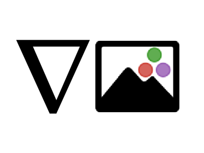

<h1 align="center">DiffImages.jl</h1>

DiffImages.jl is a Computer Vision library, which aims to make relavant parts of the [JuliaImages](https://github.com/JuliaImages) ecosystem differentiable. 

We have started with making parts of [Images.jl](https://github.com/JuliaImages/Images.jl) and [ImageTransformations.jl](https://github.com/JuliaImages/ImageTransformations.jl) differentiable.

Currently, we provide support to the following modules:
- Warping modules inside of ImageTransformations.jl.
    - which includes [`ImageTransformations.warp`](https://juliaimages.org/ImageTransformations.jl/stable/reference/#ImageTransformations.warp), with support for transformations from [CoordinateTransformations.jl](https://github.com/JuliaGeometry/CoordinateTransformations.jl).
- Colorspace modules from [ImageCore.jl](https://github.com/JuliaImages/ImageCore.jl).

In the future, we aim to extend support to kernels from [ImageFiltering.jl](https://github.com/JuliaImages/ImageFiltering.jl) as well as extend support to image derivatives which are not currently possible due to no implementations for different types of interpolants used in [Interpolations.jl](https://github.com/JuliaMath/Interpolations.jl).

This library started off as a Julia Seasons of Code project. It continues to move ahead for being a very interesting, yet unexplored field of research. I am currently maintaining the library. After ticking off some things I had in my mind for implementations, I will welcome more contributions to the library.

I would like to thank my mentors for the invaluable support they have given me throughout the coding phase, and continue to give me till date. They are:
- [Johnny Chen](https://github.com/johnnychen94)
- [Dhairya Gandhi](https://github.com/DhairyaLGandhi)
