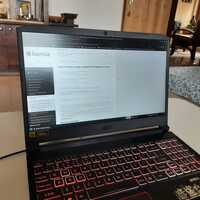
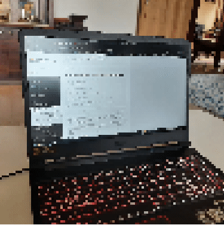

# Tutorials

## Homography warps
```@contents
Pages = ["warp.md"]
Depth = 5
```
Homography matrices are projective transformations. They can be represented using `DiffImages.Homography()` in Julia using `DiffImages`.

In this example, we will train a homography matrix using DiffImages.jl.
### Importing the libraries
```@repl 1
using DiffImages, ImageCore, ImageTransformations, FileIO, Zygote
```

### Loading the images
Let us load the images first. We will also convert them to `Float32` precision type since we do not need such high precision.
```@repl 1
img = load("source.jpg") .|> RGB{Float32} 
tgt = load("target.jpg") .|> RGB{Float32}
```
| Source Image | Destination Image |
|--------------|-------------------|
|  |  |

### Initializing the matrix and hyperparameters
Now let us define the homography matrix and other parameters such as the learning rate.
```@repl 1
h = DiffImages.Homography{Float32}()
η = 2e-10 # Varies a lot example to example
num_iters = 100
```
### Defining the criterion
Nice! Now before we jump to the training loop, let us first define an `Images`-centric version of the mean squared error loss as our criterion.
```@repl 1
function image_mse(y, ŷ)
    l = map((x, y) -> (x - y), y, ŷ)
    l = mapreducec.(x->x^2, +, 0, l)
    l = sum(l)
    l
end
```

### Defining the training loop
Great! Now that we have defined our criterion, let us now define the training loop.
```julia
for i in 1:num_iters
    ∇H, = Zygote.gradient(h) do trfm
            out = ImageTransformations.warp(img, trfm, axes(img), zero(eltype(img)))
            out = image_mse(out, tgt)
            out
        end

    out = ImageTransformations.warp(img, h, axes(img), zero(eltype(img)))
    println("Iteration: $i Loss: $(image_mse(out, tgt))")

    h = h.H - η * (∇H.H)
    h = DiffImages.Homography(h |> SMatrix{3, 3, Float32, 9})
end
```

### Results
After training your matrix successfully, you shall get something like this.

| `η = 1e-10` | `η = 2e-10` |
|-------------|-------------|
|  |  |

It is apparently difficult to train a homography matrix. Therefore, finding the right hyperparameters is the key to training it correctly.
